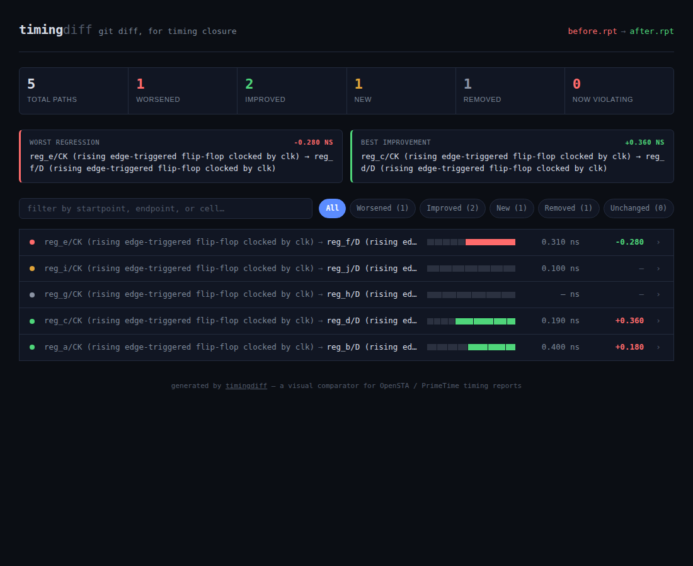
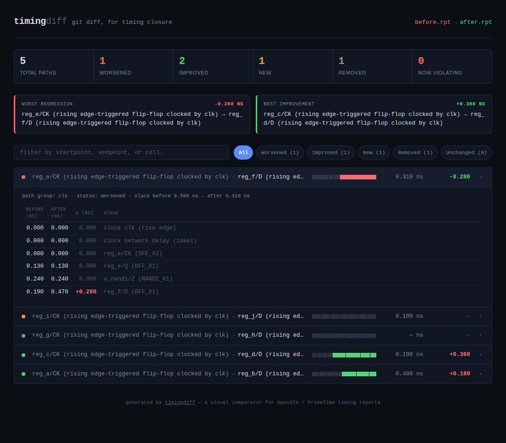

# timingdiff

**`git diff`, but for timing closure.**

**[Try it live in your browser →](https://gargihosmani.github.io/timingdiff/)**
Drop in your own two reports, or click "try it with sample data." Everything
runs client-side — your files are parsed entirely in the browser and never
uploaded anywhere.

`timingdiff` compares two STA (Static Timing Analysis) reports — from
[OpenSTA](https://github.com/The-OpenROAD-Project/OpenSTA) or
PrimeTime — and renders an interactive, visual diff: which paths got
better, which got worse, which are new or gone, and exactly which stage
of each path absorbed the delay change.

Today, engineers usually diff timing closure by eyeballing two text
reports side by side. `timingdiff` turns that into something you can
scan in seconds.



<details>
<summary>Expanded path view (stage-by-stage diff)</summary>


</details>

## What this actually does (plain English)

Computer chips only work if every signal inside them arrives exactly on time —
we're talking billionths of a second. Engineers run a check that tells them
whether every signal made its deadline, and by how much room to spare. Every
time they tweak the design, they have to re-run that check and compare it to
the old one, to make sure nothing that used to work just broke.

Today, that comparison is usually done by eye — squinting at two giant text
files side by side. `timingdiff` automates that: feed it the "before" and
"after" checks, and it instantly shows you what got faster, what got slower,
what's new, and what disappeared — and exactly which step of each signal's
path is responsible for the change.

Think of it like "track changes," but for chip timing instead of a Word doc.

## Why it's useful

- **Saves time.** No more manually diffing two text files line by line.
- **Nothing to install to view a report.** Open a single HTML file, or use it straight in the browser.
- **Sorts the important stuff to the top.** The worst regression in your whole design is always the first thing you see — you don't have to go hunting for it.
- **Shows *where*, not just *that*.** Click into any path and see exactly which cell or stage absorbed the delay, instead of just "it got worse."
- **Free and open source.** Anyone can use it, read the code, or extend it.
- **Fits into automated workflows.** Can be wired into a CI pipeline to automatically flag timing regressions before they get merged.

## Install

```bash
git clone https://github.com/<you>/timingdiff.git
cd timingdiff
pip install -e .
```

Requires Python 3.10+. No other dependencies — the whole tool is
stdlib Python plus a self-contained HTML/CSS/JS template.

## Usage

```bash
timingdiff before.rpt after.rpt -o diff.html --open
```

Generate `before.rpt` / `after.rpt` from OpenSTA with something like:

```tcl
report_checks -path_delay max -group_count 50 > before.rpt
# ... make your RTL/constraint/placement change ...
report_checks -path_delay max -group_count 50 > after.rpt
```

Then try it on the bundled sample data:

```bash
timingdiff samples/before.rpt samples/after.rpt -o demo.html --open
```

### CLI options

| Flag | Description |
|---|---|
| `-o, --output PATH` | output HTML file (default `timingdiff.html`) |
| `--open` | open the report in your default browser after generating it |
| `--json PATH` | also write the raw diff as JSON, for scripting/CI dashboards |
| `--fail-on-regression` | exit with status `1` if any path worsened or newly violates timing |

## How it works

1. **`parser.py`** reads a `report_checks`-style text report and extracts each timing path: startpoint, endpoint, path group, the incremental-delay stage table, and the final slack.
2. **`diff.py`** matches paths across the two reports by `(startpoint, endpoint, path group)`, computes the slack delta, and positionally aligns each path's stage rows to flag which cell delays changed (and whether the cell type itself changed, e.g. a resize during ECO).
3. **`report.py`** renders everything into one HTML file: sortable/filterable path list, per-path "waterfall" of stage deltas, and an expandable git-diff-colored stage table.
4. **`docs/index.html` + `docs/timingdiff-core.js`** are a from-scratch JavaScript port of steps 1–2, so the [live demo](https://gargihosmani.github.io/timingdiff/) can parse and diff reports entirely client-side — no server, no install, and your files never leave your browser. The two implementations are kept in sync manually; if you change the parsing/diff logic in Python, mirror it in `timingdiff-core.js`.

## Development

```bash
pip install -e ".[dev]"
pytest tests/ -v
```

## Roadmap / ideas

- [ ] Min (hold) path support alongside max (setup)
- [ ] Multi-corner diffing (compare across PVT corners, not just before/after)
- [ ] Direct OpenROAD `.def`/SPEF hooks to auto-generate before/after reports from two GDS iterations
- [ ] `--group-by` to roll up regressions by clock domain or module hierarchy

Contributions and issues welcome.

## License

MIT — see [LICENSE](LICENSE).
